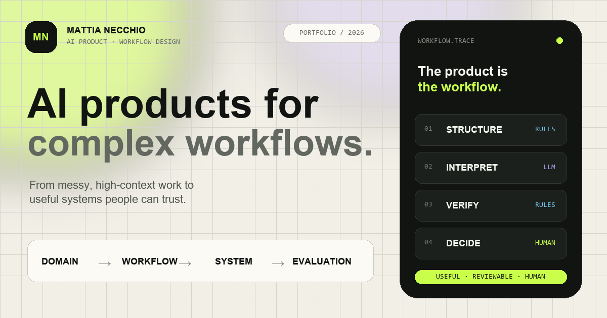

# Mattia Necchio — AI Product & Workflow Designer

A fast, accessible and privacy-conscious portfolio about turning complex
knowledge work into useful AI products. It shows the reasoning between domain
discovery and implementation: workflow mapping, hybrid deterministic/AI
architecture, evaluation, human review and explicit production handoffs.

**Live site:** [mattian94.github.io](https://mattian94.github.io/)

## What is inside

- Selected system patterns with transparent decision logs.
- An on-device Workflow Architect that explains where rules, AI and human
  judgement belong.
- A focused 90-second recruiter tour.
- Keyboard-first evidence search with Ctrl+K or Command+K.
- Light and dark themes, responsive layouts and print-friendly content.
- A resilient 404 recovery workflow with a small easter egg.
- Machine-readable context through robots.txt, sitemap.xml, llms.txt,
  humans.txt and structured data.
- No advertising, behavioural analytics or remote AI calls.

The interactive tools are explanatory product demonstrations. They run in the
browser and do not send or store visitor input.

## Technical approach

The site intentionally uses standards-based HTML, CSS and JavaScript without a
front-end framework or runtime dependencies. GitHub Pages serves the static
output directly.

This keeps the implementation:

- inspectable by recruiters and engineers;
- usable without a build step;
- fast on constrained devices;
- resilient when JavaScript is unavailable;
- straightforward to audit and deploy.

## Project structure

~~~
.
├── index.html                 # Portfolio and interactive product demos
├── 404.html                   # Accessible recovery experience
├── sw.js                      # Small offline cache for core static assets
├── assets/
│   ├── app.js                 # Progressive interactions
│   ├── styles.css             # Responsive visual system
│   ├── favicon.svg
│   ├── icon-192.png
│   ├── icon-512.png
│   └── og-card.png
├── scripts/validate.mjs       # Dependency-free quality gate
├── .github/workflows/
│   ├── quality.yml            # Pull-request and main-branch validation
│   └── pages.yml              # Validated GitHub Pages deployment
├── .well-known/security.txt
├── site.webmanifest
├── robots.txt
├── sitemap.xml
├── humans.txt
├── llms.txt
└── hire-me.txt
~~~

## Run locally

No installation is required. Serve the repository root with any static server:

~~~sh
python -m http.server 8080
~~~

Then open [localhost:8080](http://localhost:8080/).

Opening index.html directly also works for the core content, but a local server
better matches GitHub Pages and enables browser APIs that require a secure or
HTTP context.

## Validate

Node.js 22 or newer is required. The repository has no npm dependencies.

~~~sh
npm run validate
~~~

The deterministic validator checks:

- required public and repository files;
- local files, internal anchors, CSS assets and manifest references;
- canonical, Open Graph, Twitter and indexing metadata;
- JSON-LD syntax and expected ProfilePage/Person entities;
- accidental secrets, unfinished copy and unsafe URL patterns;
- explicit file and total transfer-size budgets;
- core accessibility semantics such as language, landmarks, labels, button
  types, dialog names and ARIA references.

The same command runs for pull requests, pushes to main and before every Pages
deployment.

## Deployment

The repository is the GitHub user site
[MattiaN94/MattiaN94.github.io](https://github.com/MattiaN94/MattiaN94.github.io).
Pushing to main runs validation, stages only public site files and deploys the
artifact through GitHub Pages.

In the repository settings, Pages must use **GitHub Actions** as its source.
The deployment workflow uses the protected github-pages environment and the
minimum deployment permissions required by GitHub.

## Content and privacy

Client-confidential details, private data and unverifiable performance metrics
are intentionally excluded. Published case studies describe transferable
problem patterns, product reasoning and system boundaries.

The portfolio does not include API credentials. Any future network-backed AI
feature must place secrets behind a separately secured server-side endpoint;
credentials must never be shipped to browser JavaScript.

## Security and license

Please report vulnerabilities privately according to [SECURITY.md](SECURITY.md).
The code is available under the [MIT License](LICENSE). Portfolio text,
identity and personal brand assets remain attributable to Mattia Necchio.
